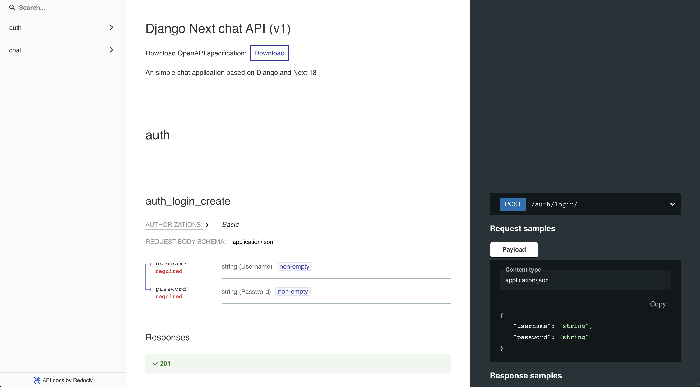
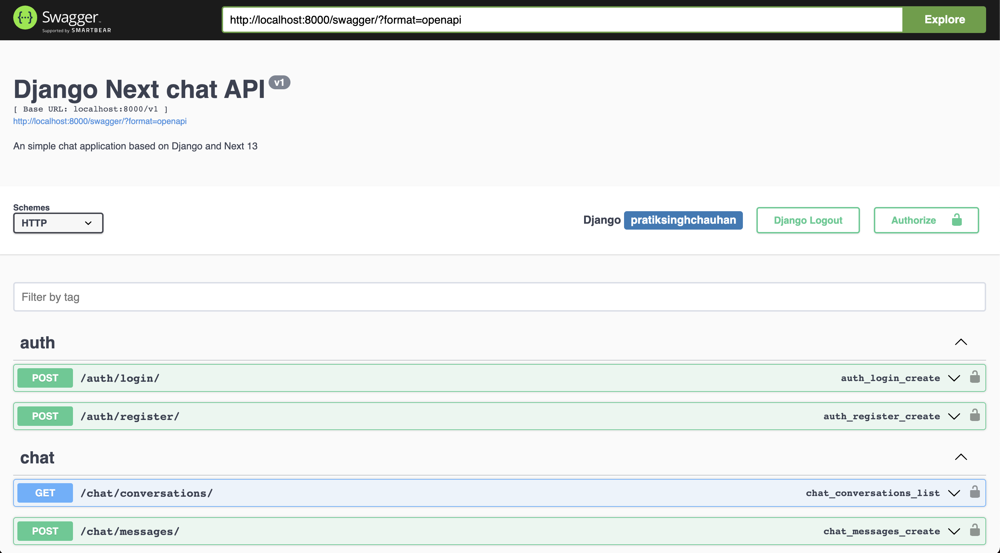

Django Next 13 Chat Application Backend
========================================

**Django Next 13 Chat Application Backend** is for a sample chat application.

Meta
----

Author:
    pratiksinghchauhan

Status:
    maintained, in development

Version:
    1

Django Version:
    4.0

Python Version:
    3.9.17

Usage
-----

To utilize this repository, begin by cloning it. Then, install the necessary requirements and execute the code. Refer to the commands provided below for guidance:

Clone the Project
    $ git clone https://github.com/pratiksinghchauhan/dj-next-chat-backend.git 

Install the dependencies
    $ pip install -r requirements/development.txt

Rename .env.example to .env and update it with Postgres credentials. And then run the following commands
    $ python manage.py migrate

Then run the server using
    $ python manage.py runserver

To run the tests
    $ python manage.py test

Documentation
-------------

To read the API documentation, run the project and  head over to `Swagger <localhost:8000/swagger/>`_ or `Redoc <localhost:8000/redoc/>`_ as shown in the screenshots below

